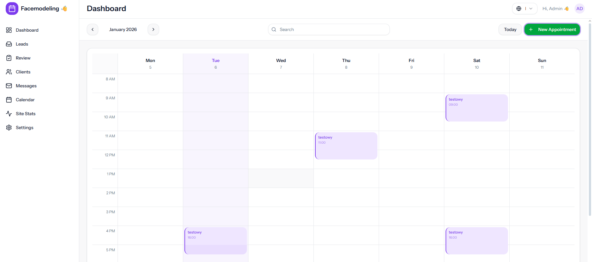
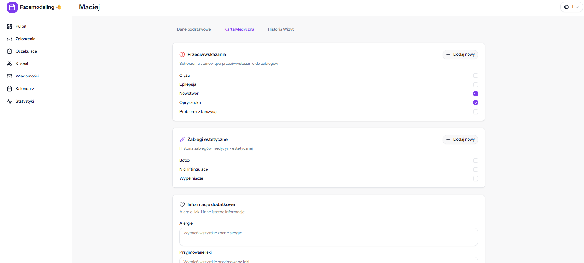
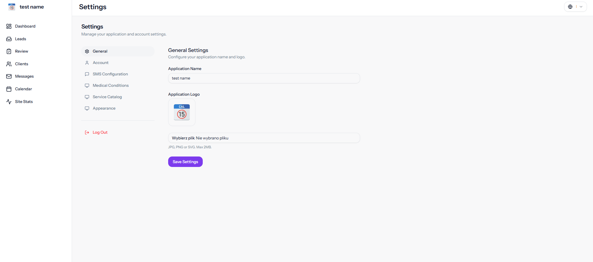
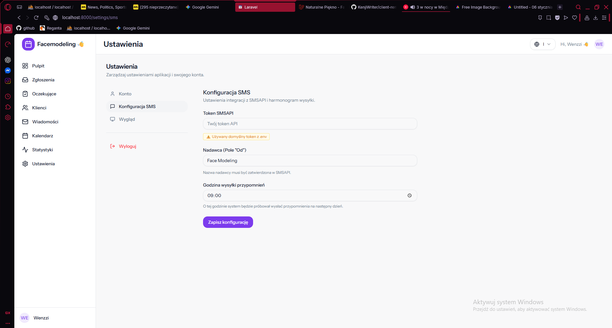

# Client Reminder App

A small business appointment + SMS reminder system.

## Documentation Navigation
- [Features](#features)
  - [Dashboard & Analytics](#-dashboard--analytics)
  - [Appointment Management](#-appointment-management)
  - [Client Management](#-client-management)
  - [Communication](#-communication)
  - [Medical Conditions Management](#%EF%B8%8F-medical-conditions-management)
  - [App Branding Configuration](#%EF%B8%8F-app-branding-configuration)
- [Setup](#setup)
- [Configuration](#configuration)
  - [Queue & Scheduler](#queue--scheduler)
  - [SMS Configuration](#sms-configuration)
- [Google Calendar Integration](#google-calendar-integration)


## Features

### 📊 Dashboard & Analytics
- **Key Performance Indicators (KPIs)**:
  - Total Clients, Appointments, and Canceled visits
  - Period-based metrics (7/30/90 days, MTD): New Clients, SMS Sent, Rescheduled, Canceled
- **Interactive Charts**:
  - Appointments per day (Area chart)
  - SMS Sent per day (Line chart)
  - New Clients per day (Bar chart)
  - Reschedules per day (Line chart)
- **Filters**: Date range filtering (7d, 30d, 90d, Month-to-Date, Custom Range)

### 📅 Appointment Management
- **Calendar View**: Visual overview of all scheduled visits
  - **Drag & Drop**: Easily move appointments to new times or days
  - **Resizing**: Adjust duration with top/bottom handles (15-min increments)
- **Status Tracking**: Confirmed, Pending Approval, Canceled, Completed
- **SMS Reminders**: Automated 24h reminders via queue/scheduler process



### 👥 Client Management
- **Profile**: Detailed client information and history
- **Medical Card**: Dynamic medical history with contraindications and esthetic procedures
- **Quick Add**: On-the-fly creation of new medical condition types from client profile
- **Safety Badges**: Visual indicators for high-risk conditions (pregnancy, epilepsy) and recent procedures
- **Public Page**: Unique public link for each client to check their appointments
- **Self-Service**: Clients can request rescheduling or cancellation via their public page
- **Reschedule Workflow**: Admin approval system for client-requested changes

### 💬 Communication
- **SMS Logs**: Full history of sent messages with delivery status
- **Templates**: Configurable SMS footer and content (via translations)

### ⚕️ Medical Conditions Management
- **Dynamic System**: Database-driven medical conditions instead of hardcoded fields
- **Admin Panel**: CRUD interface for managing condition types (Settings > Medical)
- **Categories**: Contraindications (high-risk) and Esthetic Procedures (tracking)
- **Metadata**: Configurable severity levels, date requirements, and active status
- **Client Integration**: Real-time condition management in client medical card
- **Quick Add**: Create new condition types without leaving the client profile



### ⚙️ App Branding Configuration
- **Custom App Name**: Set your business name displayed in:
  - Page titles (Browser tabs)
  - Sidebar navigation
  - Application header
- **Custom Logo**: Upload your logo (JPG, PNG, SVG, max 2MB) displayed as:
  - Sidebar icon
  - Browser favicon
  - App icon on mobile devices
- **Settings Location**: Settings > General
- **Fallback**: Uses default values from `.env` if not configured



## Setup

1. **Clone the repository**
2. **Install dependencies**
   ```bash
   composer install
   npm install
   ```
3. **Environment Setup**
   ```bash
   cp .env.example .env
   php artisan key:generate
   ```
4. **Database and Seeding**
   Configure your database credentials in `.env`, then run migrations with seed data:
   ```bash
   php artisan migrate:fresh --seed
   ```
   
   This will create:
   - **Admin User**: Email: `admin@admin.com` / Password: `secret`
   - **Default Settings**: Timezone, SMS configuration placeholders
   - **Medical Condition Types**: 8 base conditions (Pregnancy, Epilepsy, Botox, Fillers, etc.)
   
   > **Note**: You can change the admin credentials in Settings > Account after logging in.
5. **Generate Routes**
   Required for frontend to access Laravel routes and typed route helpers (Ziggy + Wayfinder).
   ```bash
   php artisan ziggy:generate
   php artisan wayfinder:generate
   ```
6. **Build Frontend**
   ```bash
   npm run build
   ```

## Configuration

### Queue & Scheduler

This application uses Laravel Queues and the Scheduler to send SMS reminders.

1. **Queue Configuration**
   Ensure your `.env` is set to use the database driver (or redis):
   ```
   QUEUE_CONNECTION=database
   ```
   
   **Local Development:**
   ```bash
   php artisan queue:work
   ```

   **Production (Supervisor):**
   In production, use Supervisor to keep the queue worker running.
   
   Install Supervisor:
   ```bash
   sudo apt-get install supervisor
   ```

   Create configuration file `/etc/supervisor/conf.d/client-reminder-worker.conf`.
   **Important:** Replace `/path/to/project` with your actual path (e.g., `/var/www/client-reminder-app`).

   ```ini
   [program:client-reminder-worker]
   process_name=%(program_name)s_%(process_num)02d
   # Replace /path/to/project with your actual root directory
   command=php /path/to/project/artisan queue:work database --sleep=3 --tries=3
   autostart=true
   autorestart=true
   user=www-data
   numprocs=1
   redirect_stderr=true
   # Replace /path/to/project with your actual root directory
   stdout_logfile=/path/to/project/storage/logs/worker.log
   stopwaitsecs=3600
   ```
   
   After creating the file:
   ```bash
   sudo supervisorctl reread
   sudo supervisorctl update
   sudo supervisorctl start client-reminder-worker:*
   ```

2. **Scheduler**
   The scheduler handles checking for upcoming appointments. Add the following Cron entry to your server:
   ```bash
   * * * * * cd /path-to-your-project && php artisan schedule:run >> /dev/null 2>&1
   ```
   
   The scheduler runs the `reminders:send` command every minute.
   
   Locally, you can run:
   ```bash
   php artisan schedule:work
   ```


## SMS Configuration

This application uses an SMS provider abstraction to send appointment reminders.

### Environment Variables

Add the following to your `.env` file:

```env
SMS_DRIVER=log
SMS_FROM="Your Business Name"
SMS_REMINDER_HOURS=24
SMS_FOOTER_NOTE="Thank you for choosing our service!"
```

### SMS Drivers

**`log` (Default for Development)**
- Logs SMS messages to `storage/logs/laravel.log`
- No external API required
- Ideal for local testing

**`smsapi` (Production)**
- Integrates with SMS.API (https://www.smsapi.pl/)
- To enable: Set `SMS_DRIVER=smsapi`
- **Configuration:**
  - **Admin Panel (Recommended):** Go to **Settings > SMS Configuration**. Values set here override `.env` defaults.
  - **Environment Variables:** Set `SMSAPI_TOKEN` in `.env` as a fallback.
  
  

### Triggering Reminders Manually

**Manual Individual Reminder**
Send a reminder for a specific appointment ID. This respects guards (opt-out, already sent) unless `--force` is used. Use `--sync` to send immediately without the queue.
```bash
php artisan reminders:send {appointment_id} [--force] [--sync]
```

**Manual Bulk Check**
Run the same check the scheduler does (appointments due in ~24h):
```bash
php artisan reminders:send-bulk
```

Both commands respect the logic defined in the `AppointmentReminderSender` service.

### How It Works

1. The scheduler runs every 5 minutes
2. It finds appointments due for reminders (24 hours before by default)
3. Jobs are dispatched to the queue
4. The queue worker sends SMS via the configured provider
5. `reminder_sent_at` is marked to prevent duplicates (idempotent)


## Google Calendar Integration

The application supports 2-way synchronization with Google Calendar.

### Features
- **One-click Connect**: Users can link their Google Account via OAuth 2.0.
- **Auto-Sync**:
  - **Create**: New appointments are automatically pushed to the primary Google Calendar.
  - **Update**: Changes to time or details in the app reflect immediately in Google Calendar.
  - **Delete**: Cancelled/deleted appointments are removed from Google Calendar.

### Configuration Required

To enable this feature, you must configure a Google Cloud Project and add credentials to your `.env` file.

1.  **Google Cloud Console**:
    - Create a project at [console.cloud.google.com](https://console.cloud.google.com/).
    - Enable **Google Calendar API**.
    - Configure **OAuth Consent Screen** (User Type: External/Internal).
    - Create **OAuth 2.0 Credentials** (Web Application).
    - add Redirect URI: `http://your-app-url/settings/integrations/google/callback`

2.  **Environment Variables**:
    Add the credentials to your `.env` file:
    ```env
    GOOGLE_CLIENT_ID=your-client-id
    GOOGLE_CLIENT_SECRET=your-client-secret
    GOOGLE_REDIRECT_URI=http://localhost:8000/settings/integrations/google/callback
    ```

3.  **Usage**:
    - Go to **Settings > Integrations**.
    - Click **Connect Google Calendar**.

